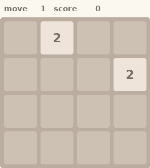

# RL 2048 — AlphaZero with a C++ MCTS engine

<p align="center">
  
  <br>
  <em>The trained agent reaching the 8192 tile — 4,676 moves, score 112,916
  (10× sped up; render your own with <code>az.render_gif</code>)</em>
</p>

AlphaZero for 2048: the game and the search trees live in C++ (bitboard
engine, PUCT MCTS, sampled chance nodes), PyTorch stays in Python. The
bridge is batched — a `Runner` steps hundreds of concurrent games, pauses
each at leaves needing evaluation, and Python answers all of them with a
single GPU forward per cycle.

## Results

Trained overnight on a single RTX 5090 (~7h wall clock, ~60 generations of
256 self-play games): the 840k-parameter net reaches **8192** in ~1–2% of
games and **4096** in ~44% when evaluated at 1536 sims/move, with mean
score ~47k. The net surpasses the heuristic teacher that bootstrapped it
by generation 14, using 40× fewer simulations per move.

## Layout

- `cpp/az_engine.cpp` — pybind11 module: batched AlphaZero MCTS runner
  plus small game utilities. Action ids: 0=down 1=up 2=right 3=left.
- `pure_cpp/run_2048_mcts.cpp` — standalone heuristic MCTS
  (no NN, ~3000 moves/s root-parallel). Two modes:
  - play one game: `./run_2048_mcts` (env: `MCTS_ITERS`, `MCTS_THREADS`)
  - self-play dump for bootstrapping: `MCTS_DUMP=prefix MCTS_GAMES=400
    MCTS_ITERS=10000 ./run_2048_mcts`
- `az/` — Python package: net, data, self-play driver, training, eval.

## Setup

```bash
git clone --recursive git@github.com:Sorrow321/RL_2048.git   # pybind11 is a submodule
cd RL_2048
git lfs pull                       # fetches the trained checkpoint
pip install -r requirements.txt    # torch with CUDA recommended

# build the C++ engine module (needs cmake, g++, OpenMP)
cmake -S . -B build -DPython_EXECUTABLE=$(which python) -DPYBIND11_FINDPYTHON=ON
cmake --build build -j             # -> ./az_engine*.so at repo root

# optional: the standalone heuristic MCTS binary
g++ -std=c++17 -O3 -march=native -pthread pure_cpp/run_2048_mcts.cpp \
    -o pure_cpp/run_2048_mcts
```

## Run the trained agent

The checkpoint that reached 8192 ships in `checkpoints/az_8192.pt` (git LFS,
3.4 MB, 840k parameters). From the repo root:

```bash
# evaluate: 64 games with MCTS at 1536 sims/move (the 8192-level setting)
python -m az.eval --ckpt checkpoints/az_8192.pt --games 64 --sims 1536

# quick strength check at lighter search
python -m az.eval --ckpt checkpoints/az_8192.pt --games 64 --sims 256

# raw policy, no search at all
python -m az.eval --ckpt checkpoints/az_8192.pt --games 100 --greedy

# record the best of N games and replay it in the terminal
python -m az.watch --ckpt checkpoints/az_8192.pt --games 32 --sims 512 --out game.json
python -m az.watch --show game.json --fps 15

# render a recorded game as an animated GIF (like the one above)
python -m az.render_gif game.json demo.gif
```

## Train

```bash
# 1) bootstrap an initial net from heuristic-MCTS self-play (~2 min total)
python -m az.bootstrap --out runs/bootstrap

# 2) AlphaZero loop: self-play -> replay buffer -> train -> eval, per generation
python -m az.train --run runs/az0 --bootstrap-net runs/bootstrap/net.pt

# 3) evaluate any checkpoint
python -m az.eval --ckpt runs/az0/latest.pt --games 32 --sims 128
python -m az.eval --ckpt runs/az0/latest.pt --games 100 --greedy
```

Metrics per generation go to `<run>/log.csv`.

## Reward and training targets

- **Environment reward** is the standard 2048 merge score: a move earns
  the summed values of all tiles created by merges on that move (merging
  two 64s earns 128). There is no other reward — no bonus for reaching a
  tile, no penalty for dying beyond the future score becoming 0.
- **Value target** for a position is the *total future merge score* from
  that position to the end of its game, squashed to `log1p(future_score) / 12`
  so it lands roughly in [0, 1]. A dead position has future score 0 and
  therefore value exactly 0; strong late-game positions approach ~1.
  Targets are computed after each game from the recorded per-move rewards.
- **Inside the search**, the net's scalar value is the only signal backed
  up the tree (terminal leaves back up 0 without calling the net).
  Per-move rewards are *not* accumulated along tree paths — log-scaled
  values don't compose additively, so the net is trained to estimate the
  aggregate directly instead.
- **Policy target**: PUCT root visit distributions from self-play. (The
  heuristic bootstrap trains on hard argmax labels instead — UCB1 visit
  counts are near-uniform and carry little signal.)
- **Move selection** in self-play: argmax of root visits, with Dirichlet
  noise on root priors for exploration; the environment's random tile
  spawns already provide game diversity, so no temperature sampling.

## Design notes
- Chance nodes sample spawns from the true 90/10 distribution with
  progressive widening and deduplication.
- Trees are arena-allocated and rebuilt each move: with 2048's chance
  branching, a reused subtree retains only ~1% of visits (measured).
